# Spark模块

## Spark RDD

### 1.Spark源码系列之foreach和foreachPartition的区别

一，基本使用

```scala
jsonRDD.foreach(each=>{
 //连接数据库
 //插入数据库
 //关闭数据库连接
})

jsonRDD.foreachPartition(partition=>{
 //此处连接上数据库
 partition.foreach(each=>
 //插入数据
 })
 //关闭数据库连接
})
```

二，源码相关
1，第一次封装

```scala
/**

 * Applies a function f to all elements of this RDD.
   */
   def foreach(f: T => Unit): Unit = withScope {
     val cleanF = sc.clean(f)
     sc.runJob(this, (iter: Iterator[T]) => iter.foreach(cleanF))
   }
   /**
 * Applies a function f to each partition of this RDD.
   */
   def foreachPartition(f: Iterator[T] => Unit): Unit = withScope {
     val cleanF = sc.clean(f)
     sc.runJob(this, (iter: Iterator[T]) => cleanF(iter))
   }
```

可以看到方法通过clean操作(清理闭包，为序列化和网络传输做准备)，进行了一层匿名函数的封装，
针对foreach方法，是我们的方法被传入了迭代器的foreach(每个元素遍历执行一次函数)，
而对于foreachpartiton方法是迭代器被传入了我们的方法(每个分区执行一次函数，我们获取迭代器后需要自行进行迭代处理，也即上述第二个demo的partition.foreach)。
2，第二次封装
这次很统一就在

```scala
 * /**
 * Run a job on a given set of partitions of an RDD, but take a function of type
 * `Iterator[T] => U` instead of `(TaskContext, Iterator[T]) => U`.
   */
   def runJob[T, U: ClassTag](
   rdd: RDD[T],
   func: Iterator[T] => U,
   partitions: Seq[Int]): Array[U] = {
     val cleanedFunc = clean(func)
     runJob(rdd, (ctx: TaskContext, it: Iterator[T]) => cleanedFunc(it), partitions)
   }
```

就是讲上述进一步封装的方法进一步按照匿名函数封装
(ctx: TaskContext, it: Iterator[T]) => cleanedFunc(it)
3，执行的时候
Spark的Task类型我们用到的也就两个
1)，ShuffleMapTask
2)，ResultTask
Action算子的方法执行是在ResultTask中执行的，也即ResultTask的runTask方法。
首先反序列化得到我们的方法(2步骤封装的)和RDD，然后执行。传入的是迭代器

```scala
val (rdd, func) = ser.deserialize[(RDD[T], (TaskContext, Iterator[T]) => U)](
  ByteBuffer.wrap(taskBinary.value), Thread.currentThread.getContextClassLoader)
_executorDeserializeTime = System.currentTimeMillis() - deserializeStartTime

metrics = Some(context.taskMetrics)
func(context, rdd.iterator(partition, context))
```

三，总结
RDD.foreach(foreachFunction)
RDD.foreachPatition(foreachPartitionFunction)
经过第二步的分析我们可以理解，展开之后实际上就是
RDD的每个分区的iterator(集合):
iterator.foreach(foreachFunction)
foreachPartitionFunction(iterator)
这就很明显了，假如我们的Function中有数据库，网络TCP等IO链接，文件流等等的创建关闭操作，采用foreachPatition方法，针对每个分区集合进行计算，更能提高我们的性能。

## Spark SQL

### 1.Hive中有1亿条数据，怎么去重（考虑效率）

用力想完，会的三种：开窗过滤、group by、count(distinct)，其实效率都不行
实际生产是拆开数据
参考：https://blog.csdn.net/weixin_39043567/article/details/100590578

### 2.Spark读写XML文件及注意事项

**导入依赖包**

小版本已经到了0.9了

```xml
<dependency>
     <groupId>com.databricks</groupId>
     <artifactId>spark-xml_2.11</artifactId>
     <version>0.9.0</version>
 </dependency>
```

XML文件示例
下面是一个关于书籍的XML文件示例：

```xml
<?xml version="1.0"?>
<catalog>
   <book id="bk101">
      <author>Gambardella, Matthew</author>

      <title>XML Developer's Guide</title>

​      <genre>Computer</genre>
​      <price>44.95</price>
​      <publish_date>2000-10-01</publish_date>
​      <description>


         An in-depth look at creating applications
         with XML.This manual describes Oracle XML DB, and how you can use it to store, generate, manipulate, manage,
         and query XML data in the database.


         After introducing you to the heart of Oracle XML DB, namely the XMLType framework and Oracle XML DB repository,
         the manual provides a brief introduction to design criteria to consider when planning your Oracle XML DB
         application. It provides examples of how and where you can use Oracle XML DB.


         The manual then describes ways you can store and retrieve XML data using Oracle XML DB, APIs for manipulating
         XMLType data, and ways you can view, generate, transform, and search on existing XML data. The remainder of
         the manual discusses how to use Oracle XML DB repository, including versioning and security,
         how to access and manipulate repository resources using protocols, SQL, PL/SQL, or Java, and how to manage
         your Oracle XML DB application using Oracle Enterprise Manager. It also introduces you to XML messaging and
         Oracle Streams Advanced Queuing XMLType support.
      </description>

   </book>
   <book id="bk102">
      <author>Ralls, Kim</author>

      <title>Midnight Rain</title>

​      <genre>Fantasy</genre>
​      <price>5.95</price>
​      <publish_date>2000-12-16</publish_date>
​      <description>A former architect battles corporate zombies, 
​      an evil sorceress, and her own childhood to become queen 
​      of the world.</description>
   </book>
   <book id="bk103">
​      <author>Corets, Eva</author>

      <title>Maeve Ascendant</title>

​      <genre>Fantasy</genre>
​      <price>5.95</price>
​      <publish_date>2000-11-17</publish_date>
​      <description>After the collapse of a nanotechnology 
​      society in England, the young survivors lay the 
​      foundation for a new society.</description>
   </book>
   <book id="bk104">
​      <author>Corets, Eva</author>

      <title>Oberon's Legacy</title>

​      <genre>Fantasy</genre>
​      <price>5.95</price>
​      <publish_date>2001-03-10</publish_date>
​      <description>In post-apocalypse England, the mysterious 
​      agent known only as Oberon helps to create a new life 
​      for the inhabitants of London. Sequel to Maeve 
​      Ascendant.</description>
   </book>
   <book id="bk105">
​      <author>Corets, Eva</author>

      <title>The Sundered Grail</title>

​      <genre>Fantasy</genre>
​      <price>5.95</price>
​      <publish_date>2001-09-10</publish_date>
​      <description>The two daughters of Maeve, half-sisters, 
​      battle one another for control of England. Sequel to 
​      Oberon's Legacy.</description>
   </book>
   <book id="bk106">
​      <author>Randall, Cynthia</author>

      <title>Lover Birds</title>

​      <genre>Romance</genre>
​      <price>4.95</price>
​      <publish_date>2000-09-02</publish_date>
​      <description>When Carla meets Paul at an ornithology 
​      conference, tempers fly as feathers get ruffled.</description>
   </book>
   <book id="bk107">
​      <author>Thurman, Paula</author>

      <title>Splish Splash</title>

​      <genre>Romance</genre>
​      <price>4.95</price>
​      <publish_date>2000-11-02</publish_date>
​      <description>A deep sea diver finds true love twenty 
​      thousand leagues beneath the sea.</description>
   </book>
   <book id="bk108">
​      <author>Knorr, Stefan</author>

      <title>Creepy Crawlies</title>

​      <genre>Horror</genre>
​      <price>4.95</price>
​      <publish_date>2000-12-06</publish_date>
​      <description>An anthology of horror stories about roaches,
​      centipedes, scorpions  and other insects.</description>
   </book>
   <book id="bk109">
​      <author>Kress, Peter</author>

      <title>Paradox Lost</title>

​      <genre>Science Fiction</genre>
​      <price>6.95</price>
​      <publish_date>2000-11-02</publish_date>
​      <description>After an inadvertant trip through a Heisenberg
​      Uncertainty Device, James Salway discovers the problems 
​      of being quantum.</description>
   </book>
   <book id="bk110">
​      <author>O'Brien, Tim</author>

      <title>Microsoft .NET: The Programming Bible</title>

​      <genre>Computer</genre>
​      <price>36.95</price>
​      <publish_date>2000-12-09</publish_date>
​      <description>Microsoft's .NET initiative is explored in 
​      detail in this deep programmer's reference.</description>
   </book>
   <book id="bk111">
​      <author>O'Brien, Tim</author>

      <title>MSXML3: A Comprehensive Guide</title>

​      <genre>Computer</genre>
​      <price>36.95</price>
​      <publish_date>2000-12-01</publish_date>
​      <description>The Microsoft MSXML3 parser is covered in 
​      detail, with attention to XML DOM interfaces, XSLT processing, 
​      SAX and more.</description>
   </book>
   <book id="bk112">
​      <author>Galos, Mike</author>

      <title>Visual Studio 7: A Comprehensive Guide</title>

​      <genre>Computer</genre>
​      <price>49.95</price>
​      <publish_date>2001-04-16</publish_date>
​      <description>Microsoft Visual Studio 7 is explored in depth,
​      looking at how Visual Basic, Visual C++, C#, and ASP+ are 
​      integrated into a comprehensive development 
​      environment.</description>
   </book>
</catalog>
```

**读取XML**

在format函数里指定加载数据源的格式，其中一种情况会加载你指定package路径下的一个叫做DefaultSource.scala的类；还有一种情况，使用短名称，比如csv，avro这些来标记。

```scala
package com.vivo.study.xml
import org.apache.spark.sql.SparkSession
import org.apache.spark.sql.catalyst.expressions.GenericRowWithSchema
import org.apache.spark.sql.types.StructType
object ReadBooksXMLWithNestedArray {
  def main(args: Array[String]): Unit = {
    val spark = SparkSession.builder().master("local[1]")
      .appName("SparkByExample")
      .getOrCreate()
    val df = spark.sqlContext.read
      .format("com.databricks.spark.xml")
      .option("rowTag", "book")
      .load("data/books_complex.xml")
    df.printSchema()
    df.show()
    df.foreach(row=>{
      println(""+row.getAs("author")+","+row.getAs("_id"))
      println(row.getStruct(4).getAs("country"))
      println(row.getStruct(4).getClass)
      val arr = row.getStruct(7).getList(0)
      for (i<-0 to arr.size-1){
        val b = arr.get(i).asInstanceOf[GenericRowWithSchema]
        println(""+b.getAs("name") +","+b.getAs("location"))
      }
    })
  }
}
```

输出的schema如下：

```scala
root
 |-- _id: string (nullable = true)
 |-- author: string (nullable = true)
 |-- description: string (nullable = true)
 |-- genre: string (nullable = true)
 |-- otherInfo: struct (nullable = true)
 |    |-- address: struct (nullable = true)
 |    |    |-- addressline1: string (nullable = true)
 |    |    |-- city: string (nullable = true)
 |    |    |-- state: string (nullable = true)
 |    |-- country: string (nullable = true)
 |    |-- language: string (nullable = true)
 |    |-- pagesCount: long (nullable = true)
 |-- price: double (nullable = true)
 |-- publish_date: string (nullable = true)
 |-- stores: struct (nullable = true)
 |    |-- store: array (nullable = true)
 |    |    |-- element: struct (containsNull = true)
 |    |    |    |-- location: string (nullable = true)
 |    |    |    |-- name: string (nullable = true)
 |-- title: string (nullable = true)
```

大家从上面的案例应该留意以下几点：

1. 我们并没有指定schema信息，但是却打印出来了schema信息，说明spark sql自己推断出了xml格式文件的schema。
2. 嵌套深层数组类型的数据格式，并且带schema的，他的读取方式。浪尖这里也给出了案例。
3. rowTag就是 xml文件的row tag，其实还有一个root tag就是xml文件的root tag。
4. _id 字段是属于XML自身的字段，为了区分加了前缀 下划线 _ 。当然前缀 是下划线你假如看不惯的话，那就完全可以通过attributePrefix属性来修改。这些属性由于不属于用户，假如不关心，可以直接禁止掉，参数是excludeAttribute。

**写测XML
**

格式很简单，但是写XML的概率比较低。比较推荐的是parquet和orc。

```scala
df2.write
      .format("com.databricks.spark.xml")
      .option("rootTag", "books")
      .option("rowTag", "book")
      .save("src/main/resources/books_new.xml")
```

**明确的指定schema**

推断schema总是要耗性能的，而且假设你知道schema明确的指定，也方便你管理和别人接手。

```scala
package com.vivo.study.xml
import org.apache.spark.sql.SparkSession
import org.apache.spark.sql.catalyst.expressions.GenericRowWithSchema
import org.apache.spark.sql.types._
object ReadBooksXMLWithNestedArrayStruct {
  def main(args: Array[String]): Unit = {
    val spark = SparkSession.builder().master("local[1]")
      .appName("langjian")
      .getOrCreate()
    val customSchema = StructType(Array(
      StructField("_id", StringType, nullable = true),
      StructField("author", StringType, nullable = true),
      StructField("description", StringType, nullable = true),
      StructField("genre", StringType ,nullable = true),
      StructField("price", DoubleType, nullable = true),
      StructField("publish_date", StringType, nullable = true),
      StructField("title", StringType, nullable = true),
      StructField("otherInfo",StructType(Array(
        StructField("pagesCount", StringType, nullable = true),
        StructField("language", StringType, nullable = true),
        StructField("country", StringType, nullable = true),
        StructField("address", StructType(Array(
          StructField("addressline1", StringType, nullable = true),
          StructField("city", StringType, nullable = true),
          StructField("state", StringType, nullable = true)
          ))
        ))
      )),
      StructField("stores",StructType(Array(
        StructField("store",ArrayType(
          StructType(Array(
            StructField("location",StringType,true),
            StructField("name",StringType,true)
          ))
        ))
      )))
    ))
    val df = spark.sqlContext.read
      .format("com.databricks.spark.xml")
      .option("rowTag", "book")
      .schema(customSchema)
      .load("data/books_complex.xml")
    df.printSchema()
    df.show()
    df.foreach(row=>{
      println(""+row.getAs("author")+","+row.getAs("_id"))
      println(row.getAs[GenericRowWithSchema]("otherInfo").getAs("country"))
      println(row.getStruct(7).getClass)
      val arr = row.getStruct(8).getList(0)
      for (i<-0 to arr.size-1){
        val b = arr.get(i).asInstanceOf[GenericRowWithSchema]
        println(""+b.getAs("name") +","+b.getAs("location"))
      }
    })
  }
}
```

提示以下，看看我这里第三个println里如何解析嵌套型数据结构的。

对应的打印schema

```scala
root
 |-- _id: string (nullable = true)
 |-- author: string (nullable = true)
 |-- description: string (nullable = true)
 |-- genre: string (nullable = true)
 |-- price: double (nullable = true)
 |-- publish_date: string (nullable = true)
 |-- title: string (nullable = true)
 |-- otherInfo: struct (nullable = true)
 |    |-- pagesCount: string (nullable = true)
 |    |-- language: string (nullable = true)
 |    |-- country: string (nullable = true)
 |    |-- address: struct (nullable = true)
 |    |    |-- addressline1: string (nullable = true)
 |    |    |-- city: string (nullable = true)
 |    |    |-- state: string (nullable = true)
 |-- stores: struct (nullable = true)
 |    |-- store: array (nullable = true)
 |    |    |-- element: struct (containsNull = true)
 |    |    |    |-- location: string (nullable = true)
 |    |    |    |-- name: string (nullable = true)
```

这个小案例的数据如下：

```xml
<?xml version="1.0"?>
<catalog>
   <book id="bk101">
      <author>Gambardella, Matthew</author>

      <title>XML Developer's Guide</title>

​      <genre>Computer</genre>
​      <price>44.95</price>
​      <publish_date>2000-10-01</publish_date>
​      <description>


         An in-depth look at creating applications
         with XML.This manual describes Oracle XML DB, and how you can use it to store, generate, manipulate, manage,
         and query XML data in the database.


         After introducing you to the heart of Oracle XML DB, namely the XMLType framework and Oracle XML DB repository,
         the manual provides a brief introduction to design criteria to consider when planning your Oracle XML DB
         application. It provides examples of how and where you can use Oracle XML DB.


         The manual then describes ways you can store and retrieve XML data using Oracle XML DB, APIs for manipulating
         XMLType data, and ways you can view, generate, transform, and search on existing XML data. The remainder of
         the manual discusses how to use Oracle XML DB repository, including versioning and security,
         how to access and manipulate repository resources using protocols, SQL, PL/SQL, or Java, and how to manage
         your Oracle XML DB application using Oracle Enterprise Manager. It also introduces you to XML messaging and
         Oracle Streams Advanced Queuing XMLType support.
      </description>
      <otherInfo>
         <pagesCount>100</pagesCount>
         <language>english</language>
         <country>India</country>
         <address>
               <addressline1>3417 south plaza dr</addressline1>
               <city>Costa mesa</city>
               <state>CA</state>
         </address>
      </otherInfo>
      <stores>
         <store>
            <name>Costco</name>
            <location>usa</location>
         </store>
         <store>
            <name>Target</name>
            <location>UK</location>
         </store>
      </stores>

   </book>
   <book id="bk102">
      <author>Ralls, Kim</author>

      <title>Midnight Rain</title>

​      <genre>Fantasy</genre>
​      <price>5.95</price>
​      <publish_date>2000-12-16</publish_date>
​      <description>A former architect battles corporate zombies, 
​      an evil sorceress, and her own childhood to become queen 
​      of the world.</description>
​      <otherInfo>
​         <pagesCount>100</pagesCount>
​         <language>english</language>
​         <country>India</country>

         <address>
            <addressline1>3417 south plaza dr</addressline1>
            <city>Costa mesa</city>
            <state>CA</state>
         </address>
      </otherInfo>
      <stores>
         <store>
            <name>Costco</name>
         </store>
         <store>
            <name>Target</name>
         </store>
         <store>
            <name>Walmart</name>
         </store>
      </stores>
   </book>
   <book id="bk103">
      <author>Corets, Eva</author>
      <title>Maeve Ascendant</title>
      <genre>Fantasy</genre>
      <price>5.95</price>
      <publish_date>2000-11-17</publish_date>
      <description>After the collapse of a nanotechnology 
      society in England, the young survivors lay the 
      foundation for a new society.</description>
      <otherInfo>
         <pagesCount>100</pagesCount>
         <language>english</language>
         <country>India</country>
         <address>
            <addressline1>3417 south plaza dr</addressline1>
            <city>Costa mesa</city>
            <state>CA</state>
         </address>
      </otherInfo>
      <stores>
         <store>
            <name>Costco</name>
         </store>
      </stores>
   </book>
   <book id="bk104">
      <author>Corets, Eva</author>
      <title>Oberon's Legacy</title>
      <genre>Fantasy</genre>
      <price>5.95</price>
      <publish_date>2001-03-10</publish_date>
      <description>In post-apocalypse England, the mysterious 
      agent known only as Oberon helps to create a new life 
      for the inhabitants of London. Sequel to Maeve 
      Ascendant.</description>
      <otherInfo>
         <pagesCount>100</pagesCount>
         <language>english</language>
         <country>India</country>
         <address>
            <addressline1>3417 south plaza dr</addressline1>
            <city>Costa mesa</city>
            <state>CA</state>
         </address>
      </otherInfo>
      <stores>
         <store>
            <name>Costco</name>
         </store>
      </stores>
   </book>
   <book id="bk105">
      <author>Corets, Eva</author>
      <title>The Sundered Grail</title>
      <genre>Fantasy</genre>
      <price>5.95</price>
      <publish_date>2001-09-10</publish_date>
      <description>The two daughters of Maeve, half-sisters, 
      battle one another for control of England. Sequel to 
      Oberon's Legacy.</description>
      <otherInfo>
         <pagesCount>100</pagesCount>
         <language>english</language>
         <country>India</country>
         <address>
            <addressline1>3417 south plaza dr</addressline1>
            <city>Costa mesa</city>
            <state>CA</state>
         </address>
      </otherInfo>
      <stores>
         <store>
            <name>Costco</name>
         </store>
      </stores>
   </book>
   <book id="bk106">
      <author>Randall, Cynthia</author>
      <title>Lover Birds</title>
      <genre>Romance</genre>
      <price>4.95</price>
      <publish_date>2000-09-02</publish_date>
      <description>When Carla meets Paul at an ornithology 
      conference, tempers fly as feathers get ruffled.</description>
      <otherInfo>
         <pagesCount>100</pagesCount>
         <language>english</language>
         <country>India</country>
         <address>
            <addressline1>3417 south plaza dr</addressline1>
            <city>Costa mesa</city>
            <state>CA</state>
         </address>
      </otherInfo>
      <stores>
         <store>
            <name>Costco</name>
         </store>
      </stores>
   </book>
   <book id="bk107">
      <author>Thurman, Paula</author>
      <title>Splish Splash</title>
      <genre>Romance</genre>
      <price>4.95</price>
      <publish_date>2000-11-02</publish_date>
      <description>A deep sea diver finds true love twenty 
      thousand leagues beneath the sea.</description>
      <otherInfo>
         <pagesCount>100</pagesCount>
         <language>english</language>
         <country>India</country>
         <address>
            <addressline1>3417 south plaza dr</addressline1>
            <city>Costa mesa</city>
            <state>CA</state>
         </address>
      </otherInfo>
      <stores>
         <store>
            <name>Costco</name>
         </store>
      </stores>
   </book>
   <book id="bk108">
      <author>Knorr, Stefan</author>
      <title>Creepy Crawlies</title>
      <genre>Horror</genre>
      <price>4.95</price>
      <publish_date>2000-12-06</publish_date>
      <description>An anthology of horror stories about roaches,
      centipedes, scorpions  and other insects.</description>
      <otherInfo>
         <pagesCount>100</pagesCount>
         <language>english</language>
         <country>India</country>
         <address>
            <addressline1>3417 south plaza dr</addressline1>
            <city>Costa mesa</city>
            <state>CA</state>
         </address>
      </otherInfo>
      <stores>
         <store>
            <name>Costco</name>
         </store>
      </stores>
   </book>
   <book id="bk109">
      <author>Kress, Peter</author>
      <title>Paradox Lost</title>
      <genre>Science Fiction</genre>
      <price>6.95</price>
      <publish_date>2000-11-02</publish_date>
      <description>After an inadvertant trip through a Heisenberg
      Uncertainty Device, James Salway discovers the problems 
      of being quantum.</description>
      <otherInfo>
         <pagesCount>100</pagesCount>
         <language>english</language>
         <country>India</country>
         <address>
            <addressline1>3417 south plaza dr</addressline1>
            <city>Costa mesa</city>
            <state>CA</state>
         </address>
      </otherInfo>
      <stores>
         <store>
            <name>Costco</name>
         </store>
      </stores>
   </book>
   <book id="bk110">
      <author>O'Brien, Tim</author>
      <title>Microsoft .NET: The Programming Bible</title>
      <genre>Computer</genre>
      <price>36.95</price>
      <publish_date>2000-12-09</publish_date>
      <description>Microsoft's .NET initiative is explored in 
      detail in this deep programmer's reference.</description>
      <otherInfo>
         <pagesCount>100</pagesCount>
         <language>english</language>
         <country>India</country>
         <address>
            <addressline1>3417 south plaza dr</addressline1>
            <city>Costa mesa</city>
            <state>CA</state>
         </address>
      </otherInfo>
      <stores>
         <store>
            <name>Costco</name>
         </store>
      </stores>
   </book>
   <book id="bk111">
      <author>O'Brien, Tim</author>
      <title>MSXML3: A Comprehensive Guide</title>
      <genre>Computer</genre>
      <price>36.95</price>
      <publish_date>2000-12-01</publish_date>
      <description>The Microsoft MSXML3 parser is covered in 
      detail, with attention to XML DOM interfaces, XSLT processing, 
      SAX and more.</description>
      <otherInfo>
         <pagesCount>100</pagesCount>
         <language>english</language>
         <country>India</country>
         <address>
            <addressline1>3417 south plaza dr</addressline1>
            <city>Costa mesa</city>
            <state>CA</state>
         </address>
      </otherInfo>
      <stores>
         <store>
            <name>Costco</name>
         </store>
      </stores>
   </book>
   <book id="bk112">
      <author>Galos, Mike</author>
      <title>Visual Studio 7: A Comprehensive Guide</title>
      <genre>Computer</genre>
      <price>49.95</price>
      <publish_date>2001-04-16</publish_date>
      <description>Microsoft Visual Studio 7 is explored in depth,
      looking at how Visual Basic, Visual C++, C#, and ASP+ are 
      integrated into a comprehensive development 
      environment.</description>
      <otherInfo>
         <pagesCount>100</pagesCount>
         <language>english</language>
         <country>India</country>
         <address>
            <addressline1>3417 south plaza dr</addressline1>
            <city>Costa mesa</city>
            <state>CA</state>
         </address>
      </otherInfo>
      <stores>
         <store>
            <name>Costco</name>
         </store>
      </stores>
   </book>
</catalog>
```

## Spark Streaming

### 1.SparkStreaming控制小文件的输出

四个方法
参考：https://blog.csdn.net/lsr40/article/details/104970906/

### 2.Spark Streaming 中管理 Kafka Offsets 的几种方式

Offset管理概述

Spark Streaming集成了Kafka允许用户从Kafka中读取一个或者多个topic的数据。一个Kafka topic包含多个存储消息的分区（partition）。每个分区中的消息是顺序存储，并且用offset（可以认为是位置）来标记消息。开发者可以在他的Spark Streaming应用中通过offset来控制数据的读取位置，但是这需要好的offset的管理机制。

Offsets管理对于保证流式应用在整个生命周期中数据的连贯性是非常有益的。举个例子，如果在应用停止或者报错退出之前没有将offset保存在持久化数据库中，那么offset rangges就会丢失。更进一步说，如果没有保存每个分区已经读取的offset，那么Spark Streaming就没有办法从上次断开（停止或者报错导致）的位置继续读取消息。

Offsets可以通过多种方式来管理，但是一般来说遵循下面的步骤:

- 在 Direct DStream初始化的时候，需要指定一个包含每个topic的每个分区的offset用于让Direct DStream从指定位置读取数据。

- - offsets就是步骤4中所保存的offsets位置

- 读取并处理消息

- 处理完之后存储结果数据

- - 用虚线圈存储和提交offset只是简单强调用户可能会执行一系列操作来满足他们更加严格的语义要求。这包括幂等操作和通过原子操作的方式存储offset。

- 最后，将offsets保存在外部持久化数据库如 HBase, Kafka, HDFS, and ZooKeeper中

不同的方案可以根据不同的商业需求进行组合。Spark具有很好的编程范式允许用户很好的控制offsets的保存时机。认真考虑以下的情形：一个Spark  Streaming 应用从Kafka中读取数据，处理或者转换数据，然后将数据发送到另一个topic或者其他系统中（例如其他消息系统、Hbase、Solr、DBMS等等）。在这个例子中，我们只考虑消息处理之后发送到其他系统中

将Offsests存储在外部系统

在这一章节中，我们将来探讨一下不同的外部持久化存储选项

为了更好地理解这一章节中提到的内容，我们先来做一些铺垫。如果是使用 spark-streaming-kafka-0-10，那么我们建议将 enable.auto.commit 设为false。这个配置只是在这个版本生效，enable.auto.commit 如果设为true的话，那么意味着 offsets 会按照 auto.commit.interval.ms 中所配置的间隔来周期性自动提交到Kafka中。在Spark Streaming中，将这个选项设置为true的话会使得Spark应用从kafka中读取数据之后就自动提交，而不是数据处理之后提交，这不是我们想要的。所以为了更好地控制offsets的提交，我们建议将enable.auto.commit 设为false。

Spark Streaming checkpoints

使用Spark Streaming的checkpoint是最简单的存储方式，并且在Spark 框架中很容易实现。Spark Streaming checkpoints就是为保存应用状态而设计的，我们将路径这在HDFS上，所以能够从失败中恢复数据。

对Kafka Stream 执行checkpoint操作使得offset保存在checkpoint中，如果是应用挂掉的话，那么SparkStreamig应用功能可以从保存的offset中开始读取消息。但是，如果是对Spark Streaming应用进行升级的话，那么很抱歉，不能checkpoint的数据没法使用，所以这种机制并不可靠，特别是在严格的生产环境中，我们不推荐这种方式。

将offsets存储在HBase中

HBase可以作为一个可靠的外部数据库来持久化offsets。通过将offsets存储在外部系统中，Spark Streaming应用功能能够重读或者回放任何仍然存储在Kafka中的数据。

根据HBase的设计模式，允许应用能够以rowkey和column的结构将多个Spark Streaming应用和多个Kafka topic存放在一张表格中。在这个例子中，表格以topic名称、消费者group id和Spark Streaming 的batchTime.milliSeconds作为rowkey以做唯一标识。尽管batchTime.milliSeconds不是必须的，但是它能够更好地展示历史的每批次的offsets。表格将存储30天的累积数据，如果超出30天则会被移除。下面是创建表格的DDL和结构

```shell
1DDL
2create 'stream_kafka_offsets', {NAME=>'offsets', TTL=>2592000}
3RowKey Layout:
4row:           <TOPIC_NAME>:<GROUP_ID>:<EPOCH_BATCHTIME_MS>
5column family:   offsets
6qualifier:      <PARTITION_ID>
7value:         <OFFSET_ID>
```

对每一个批次的消息，使用saveOffsets()将从指定topic中读取的offsets保存到HBase中

```scala
1/*
 2 Save offsets for each batch into HBase
 3*/
 4def saveOffsets(TOPIC_NAME:String,GROUP_ID:String,offsetRanges:Array[OffsetRange],
 5                hbaseTableName:String,batchTime: org.apache.spark.streaming.Time) ={
 6  val hbaseConf = HBaseConfiguration.create()
 7  hbaseConf.addResource("src/main/resources/hbase-site.xml")
 8  val conn = ConnectionFactory.createConnection(hbaseConf)
 9  val table = conn.getTable(TableName.valueOf(hbaseTableName))
10  val rowKey = TOPIC_NAME + ":" + GROUP_ID + ":" +String.valueOf(batchTime.milliseconds)
11  val put = new Put(rowKey.getBytes)
12  for(offset <- offsetRanges){
13    put.addColumn(Bytes.toBytes("offsets"),Bytes.toBytes(offset.partition.toString),
14          Bytes.toBytes(offset.untilOffset.toString))
15  }
16  table.put(put)
17  conn.close()
18}
```

在执行streaming任务之前，首先会使用getLastCommittedOffsets()来从HBase中读取上一次任务结束时所保存的offsets。该方法将采用常用方案来返回kafka topic分区offsets。

- **情形1**：Streaming任务第一次启动，从zookeeper中获取给定topic的分区数，然后将每个分区的offset都设置为0，并返回。
- **情形2**：一个运行了很长时间的streaming任务停止并且给定的topic增加了新的分区，处理方式是从zookeeper中获取给定topic的分区数，对于所有老的分区，offset依然使用HBase中所保存，对于新的分区则将offset设置为0。
- **情形3**：Streaming任务长时间运行后停止并且topic分区没有任何变化，在这个情形下，直接使用HBase中所保存的offset即可。

在Spark Streaming应用启动之后如果topic增加了新的分区，那么应用只能读取到老的分区中的数据，新的是读取不到的。所以如果想读取新的分区中的数据，那么就得重新启动Spark Streaming应用。

```scala
1/* Returns last committed offsets for all the partitions of a given topic from HBase in  
 2following  cases.
 3*/
 4def getLastCommittedOffsets(TOPIC_NAME:String,GROUP_ID:String,hbaseTableName:String,
 5zkQuorum:String,zkRootDir:String,sessionTimeout:Int,connectionTimeOut:Int):Map[TopicPartition,Long] ={
 6  val hbaseConf = HBaseConfiguration.create()
 7  val zkUrl = zkQuorum+"/"+zkRootDir
 8  val zkClientAndConnection = ZkUtils.createZkClientAndConnection(zkUrl,
 9                                                sessionTimeout,connectionTimeOut)
10  val zkUtils = new ZkUtils(zkClientAndConnection._1, zkClientAndConnection._2,false)
11  val zKNumberOfPartitionsForTopic = zkUtils.getPartitionsForTopics(Seq(TOPIC_NAME
12                                                 )).get(TOPIC_NAME).toList.head.size
13  zkClientAndConnection._1.close()
14  zkClientAndConnection._2.close()
15  //Connect to HBase to retrieve last committed offsets
16  val conn = ConnectionFactory.createConnection(hbaseConf)
17  val table = conn.getTable(TableName.valueOf(hbaseTableName))
18  val startRow = TOPIC_NAME + ":" + GROUP_ID + ":" +
19                                              String.valueOf(System.currentTimeMillis())
20  val stopRow = TOPIC_NAME + ":" + GROUP_ID + ":" + 0
21  val scan = new Scan()
22  val scanner = table.getScanner(scan.setStartRow(startRow.getBytes).setStopRow(
23                                                   stopRow.getBytes).setReversed(true))
24  val result = scanner.next()
25  var hbaseNumberOfPartitionsForTopic = 0 //Set the number of partitions discovered for a topic in HBase to 0
26  if (result != null){
27  //If the result from hbase scanner is not null, set number of partitions from hbase 
28  to the  number of cells
29    hbaseNumberOfPartitionsForTopic = result.listCells().size()
30  }
31val fromOffsets = collection.mutable.Map[TopicPartition,Long]()
32  if(hbaseNumberOfPartitionsForTopic == 0){
33    // initialize fromOffsets to beginning
34    for (partition <- 0 to zKNumberOfPartitionsForTopic-1){
35      fromOffsets += (new TopicPartition(TOPIC_NAME,partition) -> 0)
36    }
37  } else if(zKNumberOfPartitionsForTopic > hbaseNumberOfPartitionsForTopic){
38  // handle scenario where new partitions have been added to existing kafka topic
39    for (partition <- 0 to hbaseNumberOfPartitionsForTopic-1){
40      val fromOffset = Bytes.toString(result.getValue(Bytes.toBytes("offsets"),
41                                        Bytes.toBytes(partition.toString)))
42      fromOffsets += (new TopicPartition(TOPIC_NAME,partition) -> fromOffset.toLong)
43    }
44    for (partition <- hbaseNumberOfPartitionsForTopic to zKNumberOfPartitionsForTopic-1){
45      fromOffsets += (new TopicPartition(TOPIC_NAME,partition) -> 0)
46    }
47  } else {
48  //initialize fromOffsets from last run
49    for (partition <- 0 to hbaseNumberOfPartitionsForTopic-1 ){
50      val fromOffset = Bytes.toString(result.getValue(Bytes.toBytes("offsets"),
51                                        Bytes.toBytes(partition.toString)))
52      fromOffsets += (new TopicPartition(TOPIC_NAME,partition) -> fromOffset.toLong)
53    }
54  }
55  scanner.close()
56  conn.close()
57  fromOffsets.toMap
58}
```

当我们获取到offsets之后我们就可以创建一个Kafka Direct DStream

```scala
1val fromOffsets= getLastCommittedOffsets(topic,consumerGroupID,hbaseTableName,zkQuorum,
2                                        zkKafkaRootDir,zkSessionTimeOut,zkConnectionTimeOut)
3val inputDStream = KafkaUtils.createDirectStream[String,String](ssc,PreferConsistent,
4                           Assign[String, String](fromOffsets.keys,kafkaParams,fromOffsets))
在完成本批次的数据处理之后调用saveOffsets()保存offsets.

 1/*
 2For each RDD in a DStream apply a map transformation that processes the message.
 3*/
 4inputDStream.foreachRDD((rdd,batchTime) => {
 5  val offsetRanges = rdd.asInstanceOf[HasOffsetRanges].offsetRanges
 6  offsetRanges.foreach(offset => println(offset.topic,offset.partition, offset.fromOffset,
 7                        offset.untilOffset))
 8  val newRDD = rdd.map(message => processMessage(message))
 9  newRDD.count()
10  saveOffsets(topic,consumerGroupID,offsetRanges,hbaseTableName,batchTime) 
11})
```


你可以到HBase中去查看不同topic和消费者组的offset数据

```shell
 1hbase(main):001:0> scan 'stream_kafka_offsets', {REVERSED => true}
 2ROW                                                COLUMN+CELL
 3 kafkablog2:groupid-1:1497628830000                column=offsets:0, timestamp=1497628832448, value=285
 4 kafkablog2:groupid-1:1497628830000                column=offsets:1, timestamp=1497628832448, value=285
 5 kafkablog2:groupid-1:1497628830000                column=offsets:2, timestamp=1497628832448, value=285
 6 kafkablog2:groupid-1:1497628770000                column=offsets:0, timestamp=1497628773773, value=225
 7 kafkablog2:groupid-1:1497628770000                column=offsets:1, timestamp=1497628773773, value=225
 8 kafkablog2:groupid-1:1497628770000                column=offsets:2, timestamp=1497628773773, value=225
 9 kafkablog1:groupid-2:1497628650000                column=offsets:0, timestamp=1497628653451, value=165
10 kafkablog1:groupid-2:1497628650000                column=offsets:1, timestamp=1497628653451, value=165
11 kafkablog1:groupid-2:1497628650000                column=offsets:2, timestamp=1497628653451, value=165
12 kafkablog1:groupid-1:1497628530000                column=offsets:0, timestamp=1497628533108, value=120
13 kafkablog1:groupid-1:1497628530000                column=offsets:1, timestamp=1497628533108, value=120
14 kafkablog1:groupid-1:1497628530000                column=offsets:2, timestamp=1497628533108, value=120
154 row(s) in 0.5030 seconds
16hbase(main):002:0>
17
```

将offsets存储到 ZooKeeper中

在Spark Streaming连接Kafka应用中使用Zookeeper来存储offsets也是一种比较可靠的方式。

在这个方案中，Spark Streaming任务在启动时会去Zookeeper中读取每个分区的offsets。如果有新的分区出现，那么他的offset将会设置在最开始的位置。在每批数据处理完之后，用户需要可以选择存储已处理数据的一个offset或者最后一个offset。此外，新消费者将使用跟旧的Kafka 消费者API一样的格式将offset保存在ZooKeeper中。因此，任何追踪或监控Zookeeper中Kafka Offset的工具仍然生效的。

初始化Zookeeper connection来从Zookeeper中获取offsets

 1val zkClientAndConnection = ZkUtils.createZkClientAndConnection(zkUrl, sessionTimeout, connectionTimeout)
 2val zkUtils = new ZkUtils(zkClientAndConnection._1, zkClientAndConnection._2, false)
 3def readOffsets(topics: Seq[String], groupId:String):
 4 Map[TopicPartition, Long] = {
 5 val topicPartOffsetMap = collection.mutable.HashMap.empty[TopicPartition, Long]
 6 val partitionMap = zkUtils.getPartitionsForTopics(topics)
 7 // /consumers/<groupId>/offsets/<topic>/
 8 partitionMap.foreach(topicPartitions => {
 9   val zkGroupTopicDirs = new ZKGroupTopicDirs(groupId, topicPartitions._1)
10   topicPartitions._2.foreach(partition => {
11     val offsetPath = zkGroupTopicDirs.consumerOffsetDir + "/" + partition
12     try {
13       val offsetStatTuple = zkUtils.readData(offsetPath)
14       if (offsetStatTuple != null) {
15         LOGGER.info("retrieving offset details - topic: {}, partition: {}, offset: {}, node path: {}", Seq[AnyRef](topicPartitions._1, partition.toString, offsetStatTuple._1, offsetPath): _*)
16         topicPartOffsetMap.put(new TopicPartition(topicPartitions._1, Integer.valueOf(partition)),
17           offsetStatTuple._1.toLong)
18       }
19     } catch {
20       case e: Exception =>
21         LOGGER.warn("retrieving offset details - no previous node exists:" + " {}, topic: {}, partition: {}, node path: {}", Seq[AnyRef](e.getMessage, topicPartitions._1, partition.toString, offsetPath): _*)
22         topicPartOffsetMap.put(new TopicPartition(topicPartitions._1, Integer.valueOf(partition)), 0L)
23     }
24   })
25 })
26 topicPartOffsetMap.toMap
27}
使用获取到的offsets来初始化Kafka Direct DStream

1val inputDStream = KafkaUtils.createDirectStream(ssc, PreferConsistent, ConsumerStrategies.Subscribe[String,String](topics, kafkaParams, fromOffsets))
下面是从ZooKeeper获取一组offsets的方法

注意: Kafka offset在ZooKeeper中的存储路径为/consumers/[groupId]/offsets/topic/[partitionId], 存储的值为offset
 1def persistOffsets(offsets: Seq[OffsetRange], groupId: String, storeEndOffset: Boolean): Unit = {
 2 offsets.foreach(or => {
 3   val zkGroupTopicDirs = new ZKGroupTopicDirs(groupId, or.topic);
 4   val acls = new ListBuffer[ACL]()
 5   val acl = new ACL
 6   acl.setId(ANYONE_ID_UNSAFE)
 7   acl.setPerms(PERMISSIONS_ALL)
 8   acls += acl
 9   val offsetPath = zkGroupTopicDirs.consumerOffsetDir + "/" + or.partition;
10   val offsetVal = if (storeEndOffset) or.untilOffset else or.fromOffset
11   zkUtils.updatePersistentPath(zkGroupTopicDirs.consumerOffsetDir + "/"
12     + or.partition, offsetVal + "", JavaConversions.bufferAsJavaList(acls))
13   LOGGER.debug("persisting offset details - topic: {}, partition: {}, offset: {}, node path: {}", Seq[AnyRef](or.topic, or.partition.toString, offsetVal.toString, offsetPath): _*)
14 })
15}
Kafka 本身

Apache Spark 2.1.x以及spark-streaming-kafka-0-10使用新的的消费者API即异步提交API。你可以在你确保你处理后的数据已经妥善保存之后使用commitAsync API（异步提交 API）来向Kafka提交offsets。新的消费者API会以消费者组id作为唯一标识来提交offsets

将offsets提交到Kafka中

1stream.foreachRDD { rdd =>
2  val offsetRanges = rdd.asInstanceOf[HasOffsetRanges].offsetRanges
3  // some time later, after outputs have completed
4  stream.asInstanceOf[CanCommitOffsets].commitAsync(offsetRanges)
5}

### 3.spark streaming窗口聚合操作后如何管理offset

对于spark streaming来说窗口操作之后，是无法管理offset的，因为offset的存储于HasOffsetRanges。只有kafkaRDD继承了他，所以假如我们对KafkaRDD进行了转化之后就无法再获取offset了。

还有窗口之后的offset的管理，也是很麻烦的，主要原因就是窗口操作会包含若干批次的RDD数据，那么提交offset我们只需要提交最近的那个批次的kafkaRDD的offset即可。如何获取呢？

对于spark 来说代码执行位置分为driver和executor，我们希望再driver端获取到offset，在处理完结果提交offset，或者直接与结果一起管理offset。

说到driver端执行，其实我们只需要使用transform获取到offset信息，然后在输出操作foreachrdd里面使用提交即可。

```scala
package bigdata.spark.SparkStreaming.kafka010

import java.util.Properties

import org.apache.kafka.clients.consumer.{Consumer, ConsumerRecord, KafkaConsumer}
import org.apache.kafka.common.TopicPartition
import org.apache.kafka.common.serialization.StringDeserializer
import org.apache.spark.rdd.RDD
import org.apache.spark.streaming.kafka010._
import org.apache.spark.streaming.{Seconds, StreamingContext}
import org.apache.spark.{SparkConf, TaskContext}

import scala.collection.JavaConverters._
import scala.collection.mutable

object kafka010NamedRDD {
   def main(args: Array[String]) {
      //    创建一个批处理时间是2s的context 要增加环境变量
      val sparkConf = new SparkConf().setAppName("DirectKafkaWordCount").setMaster("local[*]")
      val ssc = new StreamingContext(sparkConf, Seconds(5))

     ssc.checkpoint("/opt/checkpoint")
    
      //    使用broker和topic创建DirectStream
      val topicsSet = "test".split(",").toSet
      val kafkaParams = Map[String, Object]("bootstrap.servers" -> "mt-mdh.local:9093",
        "key.deserializer"->classOf[StringDeserializer],
        "value.deserializer"-> classOf[StringDeserializer],
        "group.id"->"test4",
        "auto.offset.reset" -> "latest",
        "enable.auto.commit"->(false: java.lang.Boolean))
    
     // 没有接口提供 offset
      val messages = KafkaUtils.createDirectStream[String, String](
        ssc,
        LocationStrategies.PreferConsistent,
        ConsumerStrategies.Subscribe[String, String](topicsSet, kafkaParams,getLastOffsets(kafkaParams ,topicsSet)))//
     var A:mutable.HashMap[String,Array[OffsetRange]] = new mutable.HashMap()
    
     val trans = messages.transform(r =>{
       val offsetRanges = r.asInstanceOf[HasOffsetRanges].offsetRanges
       A += ("rdd1"->offsetRanges)
       r
     }).countByWindow(Seconds(10), Seconds(5))
     trans.foreachRDD(rdd=>{
    
       if(!rdd.isEmpty()){
         val offsetRanges = A.get("rdd1").get//.asInstanceOf[HasOffsetRanges].offsetRanges
    
         rdd.foreachPartition { iter =>
           val o: OffsetRange = offsetRanges(TaskContext.get.partitionId)
           println(s"${o.topic} ${o.partition} ${o.fromOffset} ${o.untilOffset}")
         }
    
         println(rdd.count())
         println(offsetRanges)
         // 手动提交offset ，前提是禁止自动提交
         messages.asInstanceOf[CanCommitOffsets].commitAsync(offsetRanges)
    
       }

//       A.-("rdd1")
     })
      //    启动流
      ssc.start()
      ssc.awaitTermination()
    }
  def getLastOffsets(kafkaParams : Map[String, Object],topics:Set[String]): Map[TopicPartition, Long] ={
    val props = new Properties()
    props.putAll(kafkaParams.asJava)
    val consumer = new KafkaConsumer[String, String](props)
    consumer.subscribe(topics.asJavaCollection)
    paranoidPoll(consumer)
    val map = consumer.assignment().asScala.map { tp =>
      println(tp+"---" +consumer.position(tp))
      tp -> (consumer.position(tp))
    }.toMap
    println(map)
    consumer.close()
    map
  }
  def paranoidPoll(c: Consumer[String, String]): Unit = {
    val msgs = c.poll(0)
    if (!msgs.isEmpty) {
      // position should be minimum offset per topicpartition
      msgs.asScala.foldLeft(Map[TopicPartition, Long]()) { (acc, m) =>
        val tp = new TopicPartition(m.topic, m.partition)
        val off = acc.get(tp).map(o => Math.min(o, m.offset)).getOrElse(m.offset)
        acc + (tp -> off)
      }.foreach { case (tp, off) =>
        c.seek(tp, off)
      }
    }
  }
}
```


## Spark 调优

### 1.spark 内存，GC及数据结构调优

**一，基本概述**

调优内存的使用主要有三个方面的考虑：对象的内存占用量(你可能希望整个数据集都适合内存)，访问这些数据的开销，垃圾回收的负载。

默认情况下，java的对象是可以快速访问的，但是相比于内部的原始数据消耗估计2-5倍的空间。主要归于下面三个原因：

1),每个不同的Java对象都有一个“对象头”，它大约是16个字节，包含一个指向它的类的指针。对于一个数据很少的对象（比如一个Int字段），这可以比数据大。

2),Java字符串在原始字符串数据上具有大约40字节的开销（因为它们将它们存储在一个Chars数组中，并保留额外的数据，例如长度），并且由于String的内部使用UTF-16编码而将每个字符存储为两个字节。因此，一个10个字符的字符串可以容易地消耗60个字节。

3),常用集合类（如HashMap和LinkedList）使用链接的数据结构，其中每个条目都有一个“包装器”对象（例如Map.Entry）。该对象不仅具有头部，还包括指针（通常为8个字节）到列表中的下一个对象。

4),原始类型的集合通常将它们存储为“boxed”对象，如java.lang.Integer。

本节将从Spark的内存管理概述开始，然后讨论用户可以采取的具体策略，以便在他/她的应用程序中更有效地使用内存。具体来说，我们将描述如何确定对象的内存使用情况，以及如何改进数据结构，或通过以序列化的格式存储数据。然后我们将介绍调优Spark的缓存大小和Java垃圾回收器。

**二，spark的内存管理概述**

Spark中的内存使用大部分属于两类：执行和存储。运行内存指的是用于计算的，shuffle，joins，sorts 和aggregations，然后存储内存主要用于缓存和在集群中传播的内部数据。在spark内部，存储器和执行器共享一个统一的区域(M)。**当没有使用执行器内存的时候，存储器可以获取所有可用的执行器内存，反之亦然。**如果有需要执行器可以驱逐存储占用，但是仅仅当存储内存大于一个阈值(R)的时候才会发生。换句话说，R描述了M内部的一个子区域，R中的缓存永远不会被清除。**由于实施的复杂性，存储内存不得驱逐执行内存**。该设计保证了几个理想的性能。

首先，不使用缓存的应用程序可以将整个空间用于执行，从而避免不必要的磁盘溢写。

其次，使用缓存的应用程序可以保留最小的存储空间（R），其中数据块不受驱逐。

最后，这种方法为各种工作负载提供了合理的开箱即用性能，而不需要用户掌握内部如何分配内存的专业知识。

虽然有两个相关配置，但典型用户不需要调整它们，因为默认值适用于大多数工作负载：

1),spark.memory.fraction将M的大小表示为（JVM堆空间 - 300MB）的一部分（默认为0.75，新版本如spark2.2改为0.6）。剩余的空间（25％，对应的新版本是0.4）用于用户数据结构，Spark中的内部元数据，并且在稀疏和异常大的记录的情况下保护OOM错误。

2),spark.memory.storageFraction表示R的大小作为M的一部分（默认为0.5）。R是M内的存储空间，其中缓存的块免于被执行器驱逐。


**三，确定内存的消耗**

最好的方式去计算一个数据的的内存消耗，就是创建一个RDD，然后加入cache，这样就可以在web ui中Storage页面看到了。页面会告诉你，这个RDD消耗了多少内存。

要估计特定对象的内存消耗，请使用SizeEstimator的估计方法。这对于尝试使用不同的数据布局来修剪内存使用情况以及确定广播变量在每个执行程序堆中占用的空间量非常有用。

**四，调优数据结构**

减少内存消耗的第一种方法是避免使用增加负担的java特性，例如基于指针的数据结构和包装对象。下面几种方法可以来避免这个。

1,将数据结构设计为偏好对象数组和原始类型，而不是标准的Java或Scala集合类（例如HashMap）。fastutil库(http://fastutil.di.unimi.it/)为与Java标准库兼容的原始类型提供方便的集合类。

2,尽可能避免使用有很多小对象和指针的嵌套结构。

3,针对关键词，考虑使用数字ID或者枚举对象而不是字符串。

4,如果您的RAM少于32 GB，请设置JVM标志-XX：+ UseCompressedOops使指针为四个字节而不是八个字节。您可以在spark-env.sh中添加这些选项。

**五，序列化RDD**

尽管进行了调优，当您的对象仍然太大而无法有效存储时，一个简单的方法来减少内存使用是使用RDD持久性API中的序列化StorageLevel（如MEMORY_ONLY_SER）以序列化形式存储它们。Spark将会将每个RDD分区存储为一个大字节数组。以序列化形式存储数据的唯一缺点是数据访问变慢，因为必须对每个对象进行反序列化。如果您想以序列化形式缓存数据，我们强烈建议使用Kryo，因为它会使数据比java序列化后的大小更小（而且肯定比原Java对象更小）。

**六，垃圾回收调优**

**1，基本介绍**

当你程序的RDD频繁的变动的时候，垃圾回收将会是一个问题。RDD的一次读入，然后有很多种基于它的计算，这种情况下垃圾回收没啥问题。当JAVA需要驱逐旧的对象，为新对象腾出空间的时候，需要跟踪所有Java对象并找到无用的对象。要记住的要点是，垃圾收集的成本与Java对象的数量成正比，因此使用较少对象的数据结构（例如，Ints数组，代替LinkedList）将大大降低了成本。一个更好的方法是以序列化形式持久化对象，如上所述：每个RDD分区将只有一个对象（一个字节数组）。在尝试其他技术之前，如果GC是一个问题，首先要尝试的是使用序列化缓存。

由于任务的运行内存和RDD的缓存内存的干扰，GC也会是一个问题。

**2，测量GC的影响**

GC调优的第一步是收集关于垃圾收集发生频率和GC花费的时间的统计信息。通过将-verbose：gc -XX：+ PrintGCDetails -XX：+ PrintGCTimeStamps添加到Java选项来完成。下次运行Spark作业时，每当垃圾收集发生时，都会看到在工作日志中打印的消息。请注意，这些日志将在您的群集的Executor节点上（在其工作目录中的stdout文件中），而不是您的driver功能中。

**3，高级GC调优**

为了进一步调整垃圾收集，我们首先需要了解一些关于JVM内存管理的基本信息<详细的请看：[JVM的垃圾回收算法](http://mp.weixin.qq.com/s?__biz=MzA3MDY0NTMxOQ==&mid=2247483661&idx=1&sn=d6427470f125b58e92a5d6b27085e982&chksm=9f38e225a84f6b3374e48002abc6f86d5190a9cf5ce59fa5ad6ca4bdd2df64c654e8f85c5413&scene=21#wechat_redirect)>：

1),java的堆内存分为两个区域新生代和老年代。新生代保存的是生命周期比较短的对象，老年代保存生命周期比较长的对象。

2),新生代又分为了三个区域(Eden, Survivor1, Survivor2)。

3),垃圾收集过程的简化说明：当Eden已满时，Eden上运行了一个minor GC，并将Eden和Survivor1中存在的对象复制到Survivor2。Survivor 将进行交换。如果一个对象足够老，或者Survivor2已满，则会移动到老年代。最后当老年代接近满的时候，会触发full GC。

Spark应用程序GC调优的目标是，确保生命周期比较长的RDD保存在老年代，新生代有足够的空间保存生命周期比较短的对象。这有助于避免触发Full GC去收集task运行期间产生的临时变量。下面列举几个有用的步骤：

1),通过收集垃圾回收信息，判断是否有太多的垃圾回收过程。假如full gc在一个task完成之前触发了好几次，那说明运行task的内存空间不足，需要加内存。

2),**在gc的统计信息中，如果老年代接近满了，减少用于缓存的内存(通过减小spark.memory.Fraction)。**缓存较少的对象比降低运行速度对我们来说更有好处。另外，可以考虑减少年轻代。可以通过减小-Xmn参数设置的值，假如使用的话。假如没有设置可以修改JVM的NewRation参数。大多数JVMs默认值是2，意思是老年代占用了三分之二的总内存。这个值要足够大，相当于扩展了spark.memory.fraction.

3),如果有太多的minor gc，较少的major gc，增加Eden区内存会有帮助。将Eden区内存设置的比task运行估计内存稍微大一些。如果Eden区大小确定为E，那就将新生代的内存设置为-Xmn=4/3E，按比例增加内存是考虑到survivor区所占用的内存。

4),尝试通过设置-XX:+UseG1GC垃圾回收器为G1。在垃圾回收器是瓶颈的一些情况下，它可以提高性能。请注意，对于大的Executor堆，通过使用-XX:G!HeapRegionSize去增大G1的堆大小，显得尤为重要。

5),例如，如果您的任务是从HDFS读取数据，则可以使用从HDFS读取的数据块的大小来估计任务使用的内存量。请注意，解压缩块的大小通常是块大小的2或3倍。所以如果我们希望有3或4个任务的工作空间，HDFS块的大小是64 MB，我们可以估计Eden的大小是4 * 3 * 64MB。

5),监控垃圾收集的频率和时间如何随着新设置的变化而变化。

经验表明，GC调整的效果取决于您的应用程序和可用的内存量。下面的链接里有更多的在线描述的调优的选项，但在高层次上，管理GC的全面发生频率有助于减少开销。

### 2.了解spark的钨丝计划吗？

https://blog.csdn.net/sundujing/article/details/51424491

### 3.Spark OOM的本质。

可从两方面：map执行时oom，shuffle后oom
参考：https://www.cnblogs.com/jiangxiaoxian/p/7442022.html

# Kafka模块

## 面试回答kafka为何如此之快


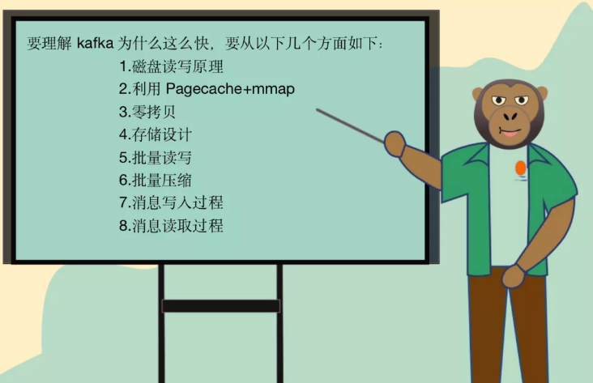

**一 磁盘读写原理**

磁盘的结构图：

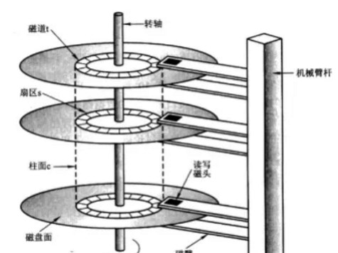

当需要从磁盘读取数据时，要确定读的数据在哪个磁道，哪个扇区：

- 首先必须找到柱面，即磁头需要移动对准相应磁道，这个过程叫做寻道，所耗费时间叫做寻道时间;
- 然后目标扇区旋转到磁头下,这个过程耗费的时间叫做旋转时间；

一次访盘请求（读/写）完成过程由三个动作组成

1. 寻道（时间）：磁头移动定位到指定磁道;
2. 旋转延迟（时间）：等待指定扇区从磁头下旋转经过；
3. 数据传输（时间）：数据在磁盘、内存与网络之间的实际传输

由于存储介质的特性，磁盘本身存取就比主存慢，再加上机械运动耗费，磁盘的存取速度往往是主存的几百分之一甚至几千分支一

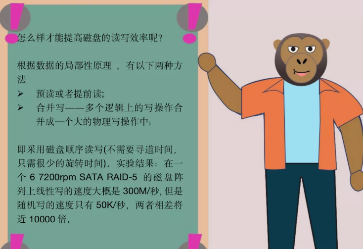

**二 利用page cache+mmap**

1.page cache

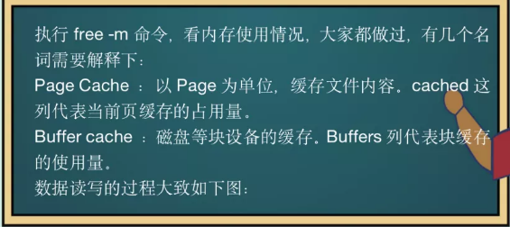

Page Cache ：以Page为单位，缓存文件内容。缓存在Page Cache中的文件数据，能够更快的被用户读取。同时对于带buffer的写入操作，数据在写入到Page Cache中即可立即返回，而不需等待数据被实际持久化到磁盘，进而提高了上层应用读写文件的整体性能。cached这列的数值表示的是当前的页缓存（page cache）的占用量，page cache文件的页数据，页是逻辑上的概念，因此page cache是与文件系统同级的

buffer cache：磁盘等块设备的缓冲，内存的这一部分是要写入到磁盘里的 。buffers列 表示当前的块缓存（buffer cache）占用量，buffer cache用于缓存块设备（如磁盘）的块数据。块是物理上的概念，因此buffer cache是与块设备驱动程序同级的。

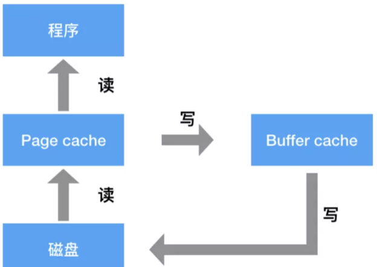


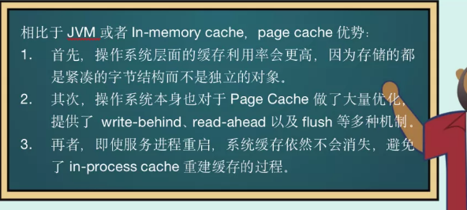

2.什么是mmap


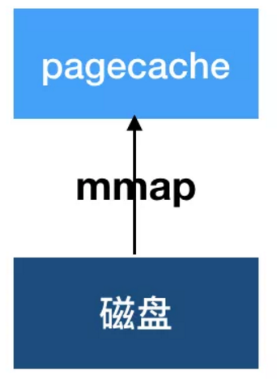

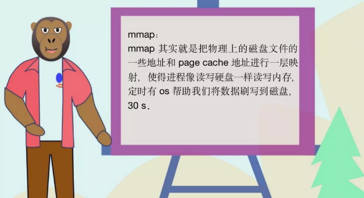

**三 零拷贝**


从系统安全和保护的角度出发，在进行计算机体系结构设计时，处理机的执行模式一般设定为两种：分别称为内核模式(内核态)和用户模式(用户态)。当处理机处于内核模式执行时，意味着系统除了可以执行一般指令外，还可以执行特权指令，即可以执行访问各种控制寄存器的指令、I/O指令以及程序状态字。

当处理机处于用户模式执行时，只能执行一般指令，而不允许执行特权指令。这样做可以保护核心代码不受用户程序有意和无意的攻击。

显然，处理机在运行期间需要在内核模式和用户模式之前进行切换。

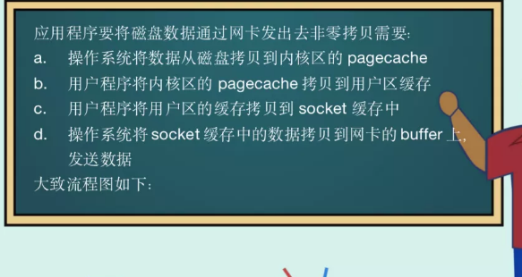

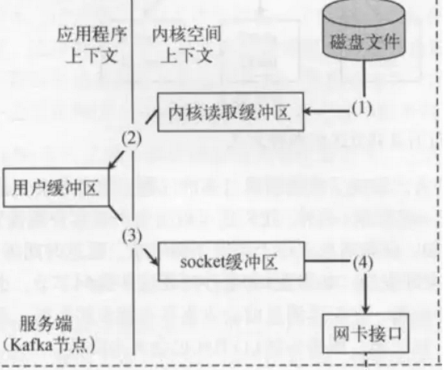

可以发现一次IO请求操作进行了2次上下文切换和4次系统调用，而同一份数据在缓存中多次拷贝，实际上对于拷贝来说完全可以直接在内核态中进行，也就是省去第2和第3步骤，变成这样：

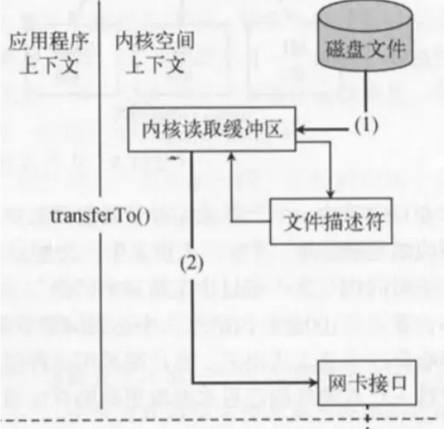

四 存储设计

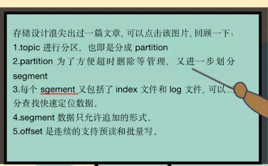

**五 批量发送**

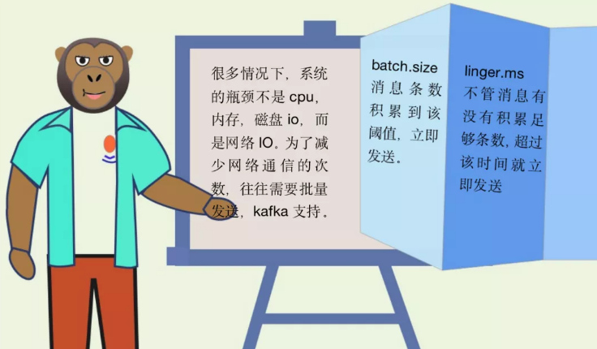

六 压缩

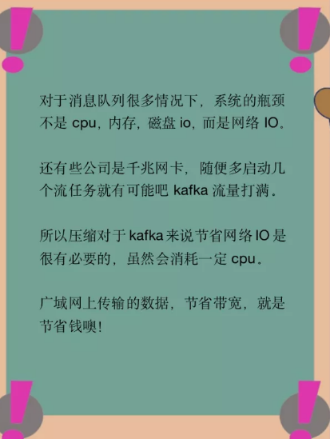

1. 如果每个消息都压缩，但是压缩率相对很低，所以Kafka使用了批量压缩，即将多个消息一起压缩而不是单个消息压缩
2. Kafka允许使用递归的消息集合，批量的消息可以通过压缩的形式传输并且在日志中也可以保持压缩格式，直到被消费者解压缩
3.  Kafka支持多种压缩协议，包括Gzip和Snappy压缩协议

**七 消息写的过程**

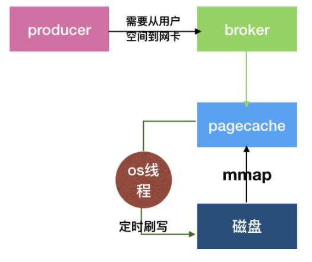

生产者发送批量压缩的数据到broker，broker通过MappedByteBuffer的map()函数映射其地址到你的虚拟内存地址。接着就可以对这个MappedByteBuffer执行写入操作了，写入的时候他会直接进入PageCache中，然后过一段时间之后，由os的线程异步刷入磁盘中，可以看上面的示意图。

上图中似乎只有一次数据拷贝的过程，他就是从PageCache里拷贝到磁盘文件里而已！这个就是你使用mmap技术之后，相比于传统磁盘IO的一个性能优化

**八 消息读的过程**

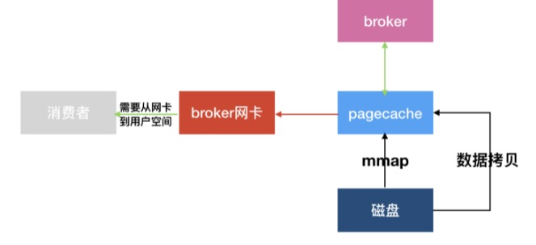

读取数据的时候，会先判断page cache中是否存在，存在就可以直接从page cache中消费，所以消费实时数据就会速度快很多。但是消费历史数据就不得不将历史数据重新加载到page cache，而且会污染掉page cache。

PageCache技术在加载历史数据的时候，还会将你加载的数据块的临近的其他数据块也一起加载到PageCache里去，这其实就是一个预读过程，对于需要连续读取历史数据的，也是性能的不小优化。